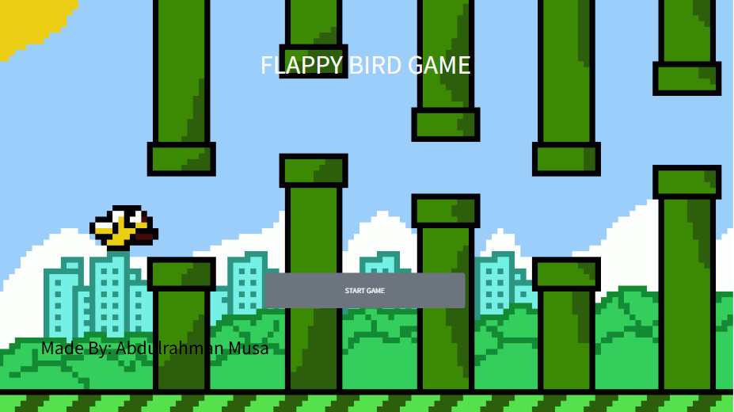
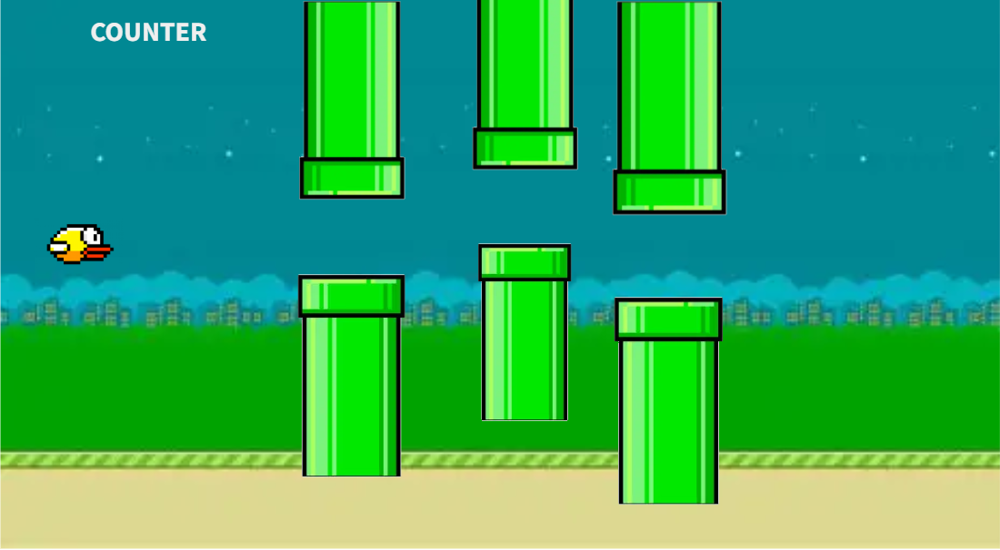

# RepoBrowserGame

## Date: 23/09/2025

### By: Abdulrahman Musa

#### [GitHub](https://github.com/Hamanilol)
***

### ***Description***
#### This is a simple browser-based version of the classic Flappy Bird game, recreated using HTML, CSS, and JavaScript.
***

### ***Technologies Used***
* Mainly just HTML,CSS,JavaScript
* I used app.mockflow.com for my pictures
***

### ***Getting Started (How to play)***

##### Click Start Game to begin.
##### It will take you immediately to the game
##### Use the mouse click to make the bird flap and for it to stay airborne to avoid the pipes or the ground.
##### Try to achieve the highest score possible!
***

### ***Screenshots***

##### image header 1

##### image header 2

### ***Future Updates***

#### ***No Future Updates yet***

### ***Credits***

##### Flappy bird: [birb]https://www.pngall.com/flappy-bird-png/

##### Pipes:[pipe]https://pixelartmaker.com/art/8afdf6b0f55c0d6

***

